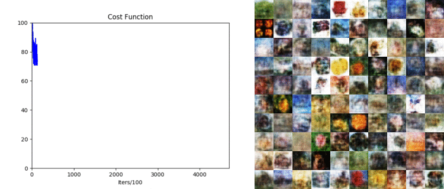

# Plummer AutoEncoder (PAE)
This repository contains the implementation of paper [Plummer Autoencoders](https://arxiv.org/abs/1802.03505).
To guarantee the reproducibility of all results, we provide the implementation 
of all methods:

1. Plummer AutoEncoder (pae)
2. Wasserstein GAN with Gradient Penalty (wgan)
3. Coulomb GAN (cougan)
4. Bidirectional GAN (bigan)
5. Variational Encoder Enhancement to GAN (veegan)
6. Variational AutoEncoder (vae)
7. Adversarial AutoEncoder (aae)
8. Adversarial Variational Bayes with Adaptive Contrast (avbac)
9. Wasserstein Autoencoder (wae)

### Demos

We generate samples during the training of PAE.

| Stacked MNIST | CIFAR-100 |
|----|----|
||


### Requirements

The implementation was developed in Python 2.7 using Tensorflow 1.2, but should work with
any version of Python and Tensorflow 1.0+ and on any platform. 
Additional libraries are tqdm and tarfile.

### How to run the code

1. **Downloading datasets**

MNIST dataset is provided [here](http://yann.lecun.com/exdb/mnist/). Download the files into the following path folder:

*data/mnist/

            t10k-images-idx3-ubyte.gz

            t10k-labels-idx1-ubyte.gz

            train-images-idx3-ubyte.gz

            train-labels-idx1-ubyte.gz

CIFAR-100 is provided [here](https://www.cs.toronto.edu/~kriz/cifar.html). Download the files into the following path folder:


*data/cifar_100/

                meta

                test

                train

2. **Training**

*setup.py* contains the general settings for different *datasets* (e.g. the architecture of generator, discriminator and encoder). 

Supported datasets are:

* **grid**: 25 Gaussians distributed uniformly on a grid.
* **low_dim_embed**: 10 10d isotropic Gaussians embedded into 1000d space.
* **color_mnist**: MNIST digits stacked on top of each other to create color digits (see above).
* **cifar_100**: realistic images belonging to 100 classes (see above).

*train.py* is the main file for training. The following parameters have to be set:

* *--method*: indicating one of the supported algorithms. This parameter is *required*.
* *--db*: indicating one of the supported datasets. This parameter is *required*.
* *--working_dir*: indicating the folder to store all training information. This parameter is *required*. We can run multiple training instances in parallel with different working dirs.
* *--hidden_acti*: activation function of hidden units. It is applied to both of generator, discriminator, and encoder. Currently *linear, relu, selu, sigmoid, tanh* are supported. This parameter is *optional*, and *linear* is applied by default.
* *--gen_out_acti*: activation function of output units in the generator. Currently *linear, relu, selu, sigmoid, tanh* are supported. This parameter is *optional*, and *linear* is applied by default.
* *--enc_out_acti*: activation function of output units in the discriminator. Currently *linear, relu, selu, sigmoid, tanh* are supported. This parameter is *optional*, and *linear* is applied by default.
* *--batch_norm*: batch normalization. This parameter is *optional*, and *0* is applied by default.
* *--gpu*: the gpu used. This parameter is *optional*, and *0* is applied by default.

Examples:

* Train pae on color_mnist:

```
python train.py --method pae --db color_mnist --working_dir pae/color_mnist --gen_out_acti sigmoid
```

* Train cougan on grid:

```
python train.py --method cougan --db grid --working_dir cougan/grid
```

* Train cougan on grid with batch normalization on gpu 0:

```
python train.py --method cougan --db grid --batch_norm 1 --working_dir cougan/grid --gpu 0
```

3. **Evaluation**

Before running evaluation, perform the following steps (this is required only the first time):

* Train a classifier to detect mode collapse.

    Examples:

    * Train classifier on low_dim_embed:

    ```
    python classifier.py --db low_dim_embed --working_dir classification/low_dim_embed
    ```

    * Train classifier on color_mnist:

    ```
    python classifier.py --db color_mnist --working_dir classification/color_mnist
    ```

* Download inception net from [here](http://download.tensorflow.org/models/image/imagenet/inception-2015-12-05.tgz) and put it into folder *utils/inception-2015-12-05*.

Now you can proceed to evaluate models.
*evaluate.py* is the main file for evaluation. 
Use the same input parameters used for training and in addition set the following parameter: 

* *--ckpt_id*: model id that you want to evaluate. Multiple ids are supported.

Examples:

* Evaluate pae trained on color_mnist at checkpoint id 1001 and 2001:

```
python evaluate.py --method pae --db color_mnist --working_dir pae/color_mnist --gen_out_acti sigmoid --ckpt_id 1001 2001
```

### More information
1. Type: ```python train.py --help```
2. Contact us

### Licensing

The code is provided "as-is" under the terms of General Public License. 
See ```LICENSE``` for full details.